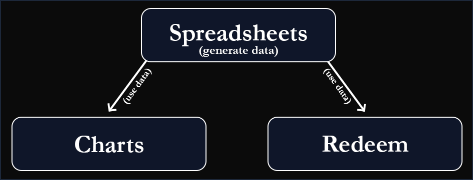

.. _project_flow:

Project Flow
=================

Modules Overview
----------------

.. grid:: 1
   :gutter: 3

   .. grid-item-card::
      :ref:`🌐 Spreadsheets <spreadsheet>`

      The ``spreadsheets`` module is responsible for downloading and processing data from CVM and other metrics.

   .. grid-item-card::
      :ref:`📊 Charts <charts>`

      The ``charts`` module is responsible for displaying processed data in an intuitive way.

   .. grid-item-card::
      :ref:`🤖 Redeem <redeem>`

      The ``redeem`` module is responsible for running investment simulations.

Project Structure
-----------------

`app/ <https://github.com/NicolasChirazawa/automacao-cotas-investimento/tree/main/app>`_
    Main project directory.

`docs/ <https://github.com/NicolasChirazawa/automacao-cotas-investimento/tree/main/docs>`_
    Sphinx documentation of the project.
    - ``options_template.json``: Template configuration file for project execution.

`app/data/ <https://github.com/NicolasChirazawa/automacao-cotas-investimento/tree/main/app/data>`_
    Stores all generated, processed data.

`app/src/ <https://github.com/NicolasChirazawa/automacao-cotas-investimento/tree/main/app/src>`_
    Contains all project modules.