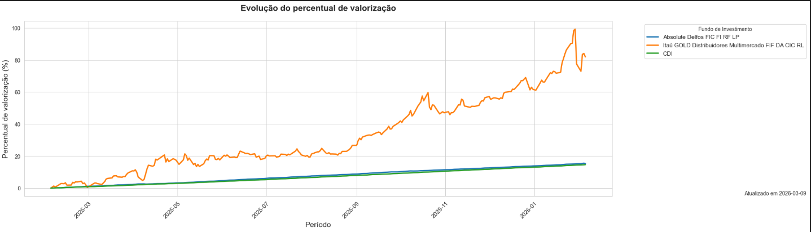

.. _charts_quota_valuation:

Quota Metric Valuation
======================

* :ref:`extract_json_quota_valuation_sec`
* :ref:`principal_functions_quota_valuation_sec`
* :ref:`process_archives_quota_evolution_sec`
* :ref:`example_charts_quota_valuation_sec`

.. _extract_json_quota_valuation_sec:

Extract options.json Data
-------------------------

The charts module uses the dates defined in the ``CHARTS`` key, with the parameters ``START_DATE`` and ``END_DATE``.

.. list-table::
   :widths: 25 75
   :header-rows: 1

   * - Name
     - Description
   * - ``START_DATE``
     - Required parameter (format: YYYY-MM-DD).
   * - ``END_DATE``
     - Required parameter (format: YYYY-MM-DD).
   * - ``INVESTMENT_CNPJ_LIST``
     - Required parameter (list of CNPJ strings) or empty.
   * - ``METRICS_DICT``
     - Required parameter (boolean values: ``true`` or ``false``).

.. _principal_functions_quota_valuation_sec:

Functions responsible for data processing
-----------------------------------------

The ``METRICS_DICT`` is converted into a list based on a boolean criterion. The resulting list and ``INVESTMENT_CNPJ_LIST`` are then converted into DataFrames.

To inform the user about potential issues due to missing processed data, a function was created to warn when the ``start_date`` of the first dataset differs from the others (both investments and metrics).

After that, all DataFrames are merged into a single DataFrame and sorted by date. This final structure is used to build the chart.

.. _example_charts_quota_valuation_sec:

Example Chart
-------------

|example_quota_evolution|
`Click here to open the image. <https://raw.githubusercontent.com/NicolasChirazawa/automacao-cotas-investimento/refs/heads/main/docs/source/_static/images/Screenshot_2.png>`_

.. warning::
   This section does not describe low-level implementation details. It focuses only on the main components and aspects that may cause confusion.

