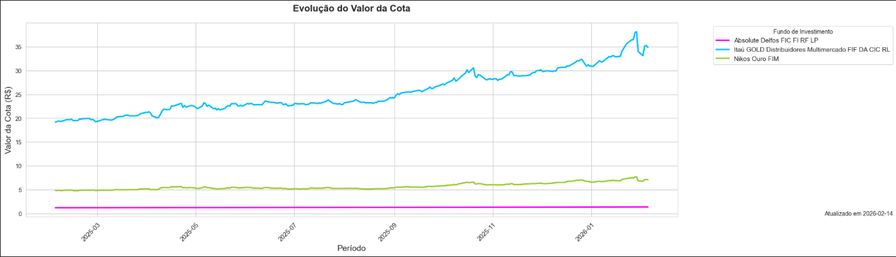

.. _charts_quota_evolution:

Quota Price Evolution
=====================

* :ref:`extract_json_quota_evolution_sec`
* :ref:`process_archives_quota_evolution_sec`
* :ref:`example_charts_quota_evolution_sec`

.. _extract_json_quota_evolution_sec:

Extract options.json Data
-------------------------

The charts module uses the dates defined in the ``CHARTS`` key, with the parameters ``START_DATE``, ``END_DATE``, and ``INVESTMENT_CNPJ_LIST`` present in the ``options.json`` file.

.. list-table::
   :widths: 25 75
   :header-rows: 1

   * - Name
     - Description
   * - ``START_DATE``
     - Required parameter (format: YYYY-MM-DD).
   * - ``END_DATE``
     - Required parameter (format: YYYY-MM-DD).
   * - ``INVESTMENT_CNPJ_LIST``
     - Required parameter.

.. _process_archives_quota_evolution_sec:

Process Archives
----------------

After retrieving the CNPJs from ``INVESTMENT_CNPJ_LIST``, the data is used to locate the processed ``.csv`` files. These files are then converted into dataframes, filtered by ``START_DATE`` and ``END_DATE``.

.. note::
   For better comparability, all investments should start from the same date. This is typically not an issue, as data is updated on common dates.

And combined into a single array used to generate the chart.

.. _example_charts_quota_evolution_sec:

Example Chart
-------------

|example_quota_evolution|
`Click here to open the image. <https://raw.githubusercontent.com/NicolasChirazawa/automacao-cotas-investimento/refs/heads/main/docs/source/_static/images/Screenshot_1.png>`_

.. warning::
   This section does not describe low-level implementation details. It focuses only on the main components and aspects that may cause confusion.

