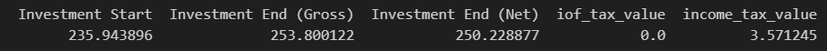

.. _redeem:

Redeem
======

* :ref:`extract_json_redeem_sec`
* :ref:`transform_investment_dataframe_redeem_sec`
* :ref:`adjust_validation_dataframe_redeem_sec`
* :ref:`tax_calculation_sec`
* :ref:`example_redeem_sec`

.. _extract_json_redeem_sec:

Extract options.json Data
-------------------------

The redeem module uses the ``INVESTMENT_CNPJ`` parameter defined in the ``REDEEM`` key.

.. list-table::
   :widths: 25 75
   :header-rows: 1

   * - Name
     - Description
   * - ``INVESTMENT_CNPJ``
     - Required parameter (format: XX.XXX.XXX/XXXX-XX).
   * - ``PURCHASE_DATE``
     - Required parameter (format: YYYY-MM-DD).
   * - ``SOLD_DATE``
     - Required parameter (format: YYYY-MM-DD).

.. _transform_investment_dataframe_redeem_sec:

Transform investment into a dataframe
-------------------------------------

The ``INVESTMENT_CNPJ`` is used to retrieve the investment name, which is then used to determine the investment file name.  
This file name, combined with the investment path, is used to locate the ``.csv`` file that will be converted into a dataframe.

.. _adjust_validation_dataframe_redeem_sec:

Adjustments and validation for redeem
-------------------------------------

The ``PURCHASE_DATE`` and ``SOLD_DATE`` parameters are converted into date objects.  
If any of these dates fall on a weekend, they are adjusted to the following Monday.

.. important::
   This adjustment is necessary because investment funds in Brazil cannot be purchased or sold on weekends.  
   In such cases, the transaction is processed on the next business day (Monday).

After that, the first and last rows of the investment dataframe are retrieved.  
The date column in these rows is compared with the adjusted ``PURCHASE_DATE`` and ``SOLD_DATE``.

A variable named ``DAYS_OFFSET`` is used to validate the dates.

- If ``PURCHASE_DATE`` is earlier than the first available date, ``DAYS_OFFSET`` is added.
- If ``SOLD_DATE`` is later than the last available date, ``DAYS_OFFSET`` is added.

If the adjusted dates are still outside the dataframe range, the operation is considered invalid, since non-existent data cannot be used.  
Otherwise:

- ``PURCHASE_DATE`` is set to the first available date.
- ``SOLD_DATE`` is set to the last available date.

The purpose of ``DAYS_OFFSET`` is to handle holidays when no valid data is available in the dataset.

Example:

Date: 01/01/2024 (Sunday)  
Processed Date: 02/01/2024 (Monday)  

Sunday → +1 day → Monday  

Processed Date: 02/01/2024 (Monday)  
Holiday: 02/01/2024 (Monday) → 04/01/2024 (Wednesday)  

Processed Date + DAYS_OFFSET: 06/01/2024 (Sunday)  

Monday → +4 days → Sunday  

.. warning::
   Investment funds in Brazil cannot be purchased or sold on weekends.  
   Transactions requested on weekends are processed on the next business day.

After completing the adjustments, the variables ``INVESTMENT_QUOTA`` and ``REDEEM_QUOTA`` are used.

Using the validated dates in the dataframe, the corresponding row indices are retrieved and adjusted as follows:

- ``PURCHASE_DATE`` + ``INVESTMENT_QUOTA``
- ``SOLD_DATE`` + ``REDEEM_QUOTA``

To ensure validity:

- The resulting rows must exist in the dataframe.
- ``PURCHASE_DATE`` cannot be later than ``SOLD_DATE``.

.. _tax_calculation_sec:

Tax calculation
---------------

The quota price is obtained based on the corresponding dataframe rows.

- **Gross**:  
  End row value − Start row value

- **Net (Liquid)**:  
  (End row value − Start row value), if the end value is greater than the start value.  
  In this case, taxes are applied to the profit.

Taxes:

- **IOF (Imposto sobre Operações Financeiras)**:  
  Starts at 96% on day 0 and decreases by 3% per day until it reaches 0%.

.. list-table::
   :widths: 25 75
   :header-rows: 1

   * - Percentage (%)
     - Days
   * - 96%
     - 0 day
   * - 93%
     - 1 day.
   * - ...
     - ...
   * - 0%
     - 31 days

- **IR (Imposto de Renda)**:  

.. list-table::
   :widths: 25 75
   :header-rows: 1

   * - Percentage (%)
     - Days interval
   * - 22.5%
     - 0 - 180 days
   * - 20%
     - 181 - 360 days
   * - 17.5%
     - 361 - 720 days
   * - 15%
     - 720+ days

.. _example_redeem_sec:

Example Redeem
--------------

|example_redeem|
`Click here to open the image. <https://raw.githubusercontent.com/NicolasChirazawa/automacao-cotas-investimento/refs/heads/main/docs/source/_static/images/Screenshot_3.png>`_

.. warning::
   This section does not describe low-level implementation details.  
   It focuses only on the main components and aspects that may cause confusion.

